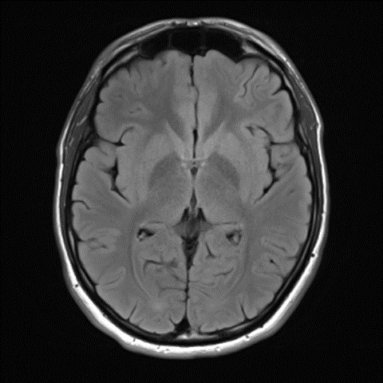
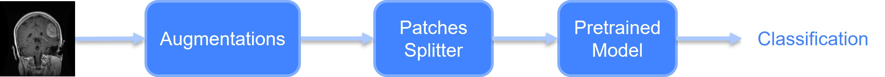
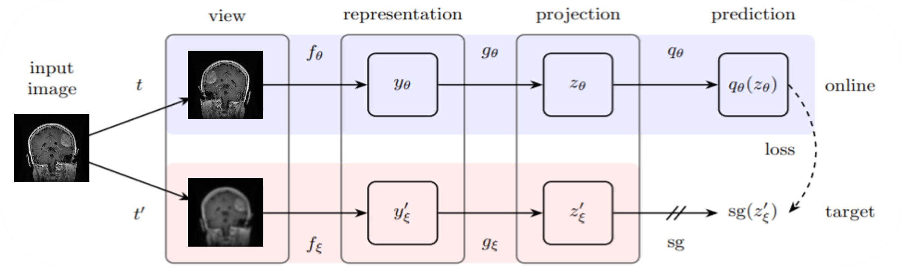
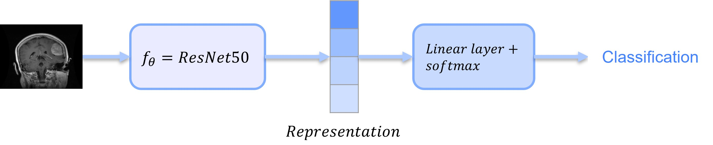
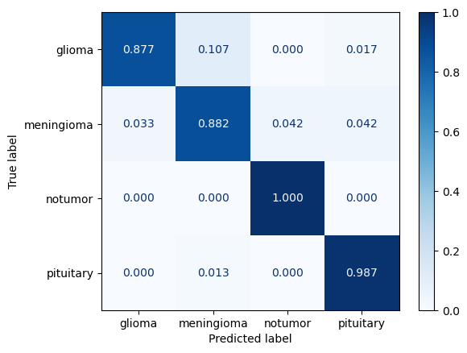
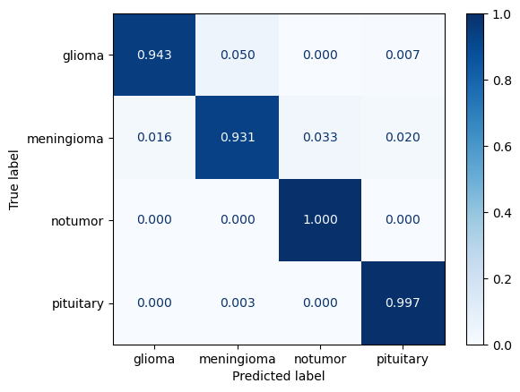
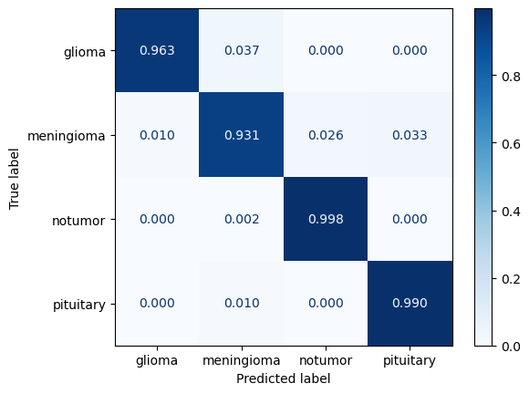
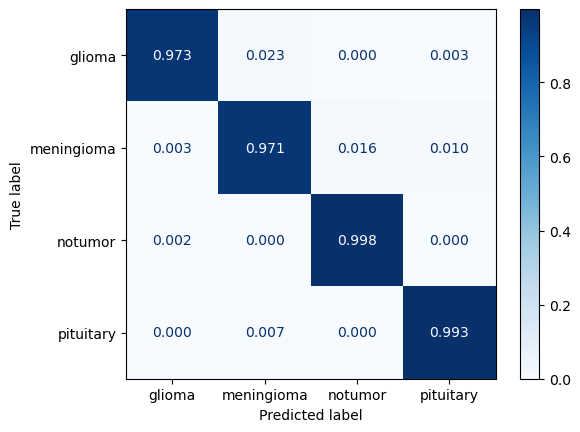
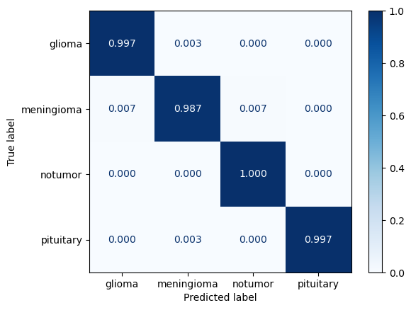

<h1 align="center">MRI Brain Tumor Patch-Based Classification</h1>
<h2 align="center">Final project for the Technion's EE Deep Learning course (046211)</h2> 
  

    Or Ronai: <a href="https://www.linkedin.com/in/orronai/">LinkedIn</a>, <a href="https://github.com/orronai">GitHub</a>
   
    Nitzan Alt: <a href="https://www.linkedin.com/in/nitzan-alt-520767234/">LinkedIn</a>, <a href="https://github.com/NitzanAlt">GitHub</a>
  

## Background
The purpose of our project is exploring some methods for classification of brain tumors in MRI images using neural networks.
Limited access to medical data and the high cost of obtaining labeled images pose challenges for training accurate models. To overcome these challenges, we employ transfer learning with pre-trained networks, divide each image into patches, and use self-supervised learning techniques. The proposed algorithm aims to achieve high accuracy while minimizing resource consumption. The study utilizes the Brain Tumor MRI Dataset and applies data augmentation and hyperparameter optimization with `Optuna` package. The results demonstrate the effectiveness of these approaches in classifying different types of brain tumors within MRI
images.

  

### Illustration for the whole system:
#### PatchNet Model (transfer-learning fine-tuning using patches)

#### BYOL model: 

#### Classifier:

## Results
###  Accuracy Comparison

  
  |Model| Not-Augmented | Augmented|
  |-----|-----|-----|
  |ResNet50| 94.13%| 97.03%|
  | DenseNet201| 97.25%| 98.47%|
  | EfficientNet-B4| 97.86%| 99.09%|
  | BYOL+ResNet50| -| 99.54%|

### ResNet50
The confusion matrices of the not-augmented and augmented results (from left to right):

  
   

### DenseNet201
The confusion matrices of the not-augmented and augmented results (from left to right):

  
   

### EfficientNet-B4
The confusion matrices of the not-augmented and augmented results (from left to right):

  
   

### BYOL+ResNet50
The confusion matrices of the augmented results:

  

#### t-SNE on 500 random test images representation 

  
   

## Files In The Repository
|File name| Purpsoe|
|---------------------------------------------------------------|-----------------------------------------------------------------|
|`dataset_preprocessing/train_validation_split.py`| Script in order to split the dataset into train-validation-test|
| `code/utils/*.py`| Save trained model for each run, save the results, and get the dataset loaders|
| `code/models/*.py`| The `PatchNet`, `BYOL` and `Classifier` models|
| `code/train.py`| Application for training each model|
| `code/optuna_train.py`| Application for finding the best hyperparameters for each model with `Optuna`|
| `code/main_*.ipynb`| Notebooks which include all data processing, training, and inference|

## Installation
1. Clone the repository
2. Install the basic packages using the provided `environment.yml` file by running: `conda env create -f environment.yml`.
3. Alternatively, you can install all the requiered packages with `pip install -r requirements.txt`.

### Prerequisites
|Library         | Version |
|--------------------|----|
|`Python`| `3.6.13 (Anaconda3)`|
|`efficientnet_pytorch`| `0.7.1`|
|`kornia`| `0.6.8`|
|`matplotlib`| `3.3.4`|
|`numpy`| `1.19.5`|
|`optuna`| `3.0.6`|
|`Pillow`| `8.4.0`|
|`scikit_learn`| `0.24.2`|
|`torch`| `1.10.2`|
|`torchvision`| `0.11.3`|
|`tqdm`| `4.64.1`|

### Run The Model
In order to train the model and choose the hyperparameters according to `Optuna` suggestion, run the following functions: `run_experiments` and `train_model`.

If necessary, load the trained weights of the wanted model (`ResNet50`, `DenseNet201`, `EfficientNet-B4` or `Byol-ResNet`).

If you want to add new model to `PatchNet`, in `code/models/model.py` file, under `PatchNet` Class, add your model, or model name.
Alternatively, if you want to add model to `BYOL`, in `code/models/byol_net.py` file, under `ByolNet` Class, add your model, or model name.

## Sources & References
### Sources
* The dataset was taken from Kaggle [Brain Tumor MRI Dataset](https://www.kaggle.com/datasets/masoudnickparvar/brain-tumor-mri-dataset).
* The code originally was adapted from the following [Brain MRI Classification using PyTorch EfficientNetB0](https://debuggercafe.com/brain-mri-classification-using-pytorch-efficientnetb0/).
* The BYOL code was adapted from the following pytorch implementation of [byol_pytorch](https://github.com/lucidrains/byol-pytorch/blob/master/byol_pytorch/byol_pytorch.py).
### Refrences
* [Bootstrap Your Own Latent: A New Approach to Self-Supervised Learning](https://arxiv.org/abs/2006.07733). 
* [Densely Connected Convolutional Networks](https://arxiv.org/abs/1608.06993v5).
* [EfficientNet: Rethinking Model Scaling for Convolutional Neural Networks](https://arxiv.org/abs/1905.11946).
* [Deep Residual Learning for Image Recognition](https://arxiv.org/abs/1512.03385).
